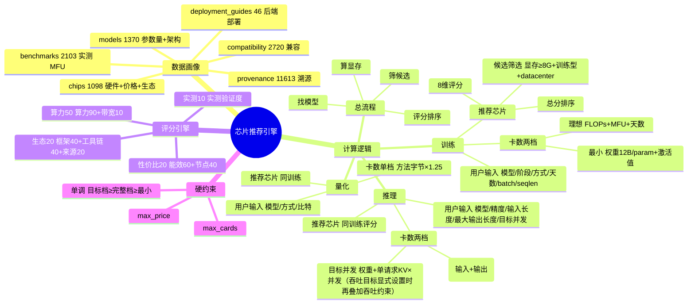

# 芯片推荐引擎 — 完整计算逻辑说明

> 本文档说明「芯片 + 模型」知识图谱的推荐引擎如何工作：有哪些数据、用户输入什么、怎么推荐芯片、怎么算卡数。
> 对应版本：评分引擎 v4.4（4 大类 4:3:2:1，8 子维度）。

---

## 1. 数据画像概览

底层是 SQLite，6 张核心表：

| 表 | 行数 | 存的是什么 |
|---|---|---|
| `chips` | 1,098 | 芯片全生命周期：硬件规格（显存/算力/带宽/功耗/制程）+ 价格 + 发布状态 + 生态评估 |
| `models` | 1,370 | 模型信息：HF 实时拉取，含参数量 `total_params_b`、架构族、`config_json`（层数/头数等） |
| `chip_model_benchmarks` | 2,103 | 芯片 × 模型的**实测**推理/训练数据（MFU、吞吐） |
| `chip_model_compatibility` | 2,720 | 芯片 ↔ 模型的兼容关系（verified / vendor_claimed / community） |
| `field_provenance` | 11,613 | 每个字段的来源 URL、新旧值、置信度（字段级溯源） |
| `deployment_guides` | 46 | 部署方案链接，按**运行时后端**（cuda/rocm/ascend/…）区分 |

**关键数据质量**（覆盖率）：

| 字段 | 覆盖率 | 说明 |
|---|---|---|
| vram_gb（显存） | 84% | 卡数计算的核心依据 |
| precision_perf（算力） | 59% | 算力评分依据 |
| tdp_w（功耗） | 69% | 能效比评分依据 |
| vram_bw_gb_s（带宽） | 37% | 带宽充裕度依据（国产芯片缺口大） |
| config_json（模型架构） | ~9% | KV Cache 需要层数/头数，缺时用默认值兜底 |

**一句话**：芯片有「硬件规格 + 生态」，模型有「参数量 + 架构」，实测数据有「benchmark」，全部字段可溯源。

---

## 2. 计算逻辑

### 总流程（训练 / 推理 / 量化通用）

```
① 找模型   → 拿到参数量、架构族、config_json、是否 MoE
② 算显存   → 训练/量化使用原有档位；推理使用最小与目标并发两档
③ 算 FLOPs → 仅训练场景需要（用于「理想部署」卡数）
④ 筛候选   → 从 chips 表按条件筛出候选芯片（见 2.1.2）
⑤ 逐芯片评分 → 按场景计算卡数档位 + 8 维度打分 → 加权总分（4 大类 4:3:2:1）
⑥ 硬约束   → 排除超 max_cards / max_price 的芯片
⑦ 排序返回 → 按总分降序取 top-N
```

### 评分引擎（4 大类 4:3:2:1，8 子维度）

每个芯片的**总分 = Σ(大类分 × 大类权重)**，每个大类分 = Σ(子维度分 × 子权重)。所有维度统一百分制（0–100）。

| 大类（权重） | 子维度（子权重） | 算什么 |
|---|---|---|
| 🌐 生态成熟度 **40%** | 框架兼容 40% | 支持几个主流框架（PyTorch/TF/JAX…） |
| | 工具链兼容 40% | 支持几个工具链（DeepSpeed/TensorRT…） |
| | 来源真实度 20% | 数据里官方来源占比 |
| 🧪 实测验证度 **30%** | 实测验证度 100% | 有没有实测 benchmark（MFU/吞吐） |
| ⚡ 算力性能 **20%** | 算力性能 90% | 单卡 FP16 TFLOPS，按全库分位数分段打分 |
| | 带宽充裕度 10% | 总显存带宽（单卡带宽×卡数）能否覆盖模型需求并支撑更高并发 |
| 💰 性价比 **10%** | 能效比 60% | GFLOPS/W（算力÷功耗） |
| | 节点效率 40% | 卡数换算成节点数，8 卡/节点最优 |

> 缺数据一律给「中性分」（约 50 分），**不排除**芯片，只是不给它加分。

---

### 2.1 训练场景

#### 2.1.1 用户输入有哪些

| 输入 | 是否必填 | 默认值 | 说明 |
|---|---|---|---|
| 模型名称 | ✅ | — | 模糊匹配 |
| 训练阶段 | ✅ | SFT | CPT / SFT / RL |
| 训练方式 | ✅（仅 SFT） | 全参微调 | 全参 / LoRA |
| 期望训练天数 | 可选 | — | 决定「理想部署」卡数 |
| 训练数据量（T tokens） | 可选 | 参数量×10 | 决定 FLOPs |
| **Batch Size** | 可选 | 1 | 决定激活值显存 |
| **样本长度（tokens）** | 可选 | 2048 | 决定激活值显存 |
| 最大卡数 / 最小卡数 | 可选 | — | 硬约束（高级筛选，默认折叠） |
| 最高单价（万元/片） | 可选 | — | 硬约束（高级筛选，默认折叠） |
| 优先国产 / 优先厂商 | 可选 | — | 影响候选筛选 |

#### 2.1.2 推荐什么芯片怎么算（详细）

分两步：**先筛候选，再打分排序**。

**第一步：候选筛选**（`get_chip_recommend_candidates`）

从 `chips` 表筛出候选池，条件：

1. **显存 ≥ 8GB**（低门槛，放所有芯片进池，卡数后面再算）
2. **用途**：训练/训推一体（训练需要「训练型」芯片，排除纯推理卡）
3. **等级**：默认 datacenter（数据中心级）
4. **国产优先**：勾选后只留 `vendor_region = domestic`
5. 按显存降序取**前 30** 个候选

> 这个「显存 ≥ 8GB」是粗筛，真正的显存卡数在「卡数计算」里按单卡显存精确算，所以 8GB 小卡也会进池、后面通过「多卡集群」的方式被推荐。

**第二步：逐芯片打分**（8 维度 → 4 大类 → 总分）

每个候选芯片按上面「评分引擎」打 8 个维度分，加权汇总成总分，最终**按总分降序**取 top-N。

- 算力强、带宽足、能效好、生态全、有实测数据的芯片排前面
- 缺数据的维度给中性分（~50），不扣分也不加分

#### 2.1.3 需要多少卡怎么算（详细，展开一层）

训练场景输出**两档卡数**，且满足单调约束：**理想 ≥ 最小**。所有卡数都向上取 2 的幂次方（1/2/4/8/16/32/64），保证 NCCL 集合通信效率。

**第一档：最小部署卡数**（能跑起来）

显存由两部分组成：

```
最小显存 = 权重+优化器 + 激活值
        = P × 12 bytes/param × 1.25  +  batch × seq × hidden × layers × 40 bytes
```

- `12 bytes/param` = 权重(2) + 梯度(2) + Adam 优化器(8)；`1.25` 是安全系数
- **激活值** = batch × 样本长度 × 隐藏维度 × 层数 × 40 字节（FP16、无梯度检查点的粗估）
- LoRA 训练时：`12 → 2.5`（冻结基座 + 小适配器，无优化器状态），激活值不变

```
最小卡数 = ceil(最小显存 / 单卡显存) → 取 2 幂次方
```

**第二档：理想部署卡数**（性能达标）

按「期望训练天数」反推需要多少卡：

```
总 FLOPs   = 6 × P × 训练数据量（tokens）
单卡每天算力 = FP16_TFLOPS × 10¹² × MFU × 86400
理想卡数   = ceil(总FLOPs / (单卡每天算力 × 训练天数)) → 取 2 幂次方
```

- **MFU**（算力利用率）：优先用 `chip_model_benchmarks` 的实测 MFU，没有则默认 **0.30**
- 若按性能反推的卡数 < 最小部署卡数，强制取最小部署卡数（单调约束）

> 卡数不再静默封顶为 64。若性能目标需要 128/256 卡，会返回真实的 2 幂次方结果，再由 `max_cards` 用户约束决定是否排除。

---

### 2.2 推理场景

#### 用户输入

| 输入 | 默认值 | 说明 |
|---|---|---|
| 模型名称 | — | 必填 |
| 推理精度 | FP16 | FP16 / INT8 / INT4-GPTQ / INT4-AWQ / GGUF Q4 / GGUF Q8 |
| **输入长度 / Prompt（tokens）** | 4096 (4K) | 单请求输入长度，与最大输出长度相加决定峰值 KV Cache |
| **最大输出长度（tokens）** | 512 | 单请求最多生成的 token 数，同样占用 KV Cache |
| **目标并发请求数** | 1 | 下拉单选：1 / 10 / 100 / 500 / 1000 / 5000，用于目标并发部署卡数 |
| 目标推理吞吐（单并发） | 不限 | 分档下拉：不限 / 10 / 50 / 100 / 500 / 1000 tok/s（每单个并发请求的吞吐） |
| 最大/最小卡数、最高单价、国产/厂商 | — | 同训练 |

#### 推荐什么芯片怎么算

候选筛选**比训练宽松**（无「训练型」用途限制，推理卡也能进），打分维度**完全相同**（4 大类 8 维度）。

#### 需要多少卡怎么算

推理输出两档卡数：**目标并发 ≥ 最小**。

**第一档：最小部署**（权重 + 单请求峰值 KV Cache）⭐

```
KV Cache 每 token = 2(K+V) × 层数 × KV头数 × head_dim × 2 bytes
单请求总 tokens = 输入 tokens + 最大输出 tokens
单请求峰值 KV Cache = 每 token KV Cache × 单请求总 tokens
权重显存 = 总参数量 × 精度字节 × 1.25
最小显存 = 权重显存 + 单请求峰值 KV Cache
卡数 = ceil(最小显存 / 单卡显存) → 2 幂次方
```

- 精度字节：FP16=2 / INT8=1 / INT4=0.5 bytes/param
- MoE 的激活参数量表示每个 token 的计算规模，并不等于常驻权重规模；标准部署按**总参数量**计算权重显存。
- KV Cache 默认保持 BF16/FP16，即每个元素 `2 bytes`。这是 KV 元素精度，与权重量化精度独立；权重 INT4 不代表 KV 自动变成 INT4。FP8 KV Cache 只有后端显式支持时才能按 `1 byte/element` 另算。
- 架构参数（层数/KV头数/head_dim）从模型 `config_json` 读，缺则用「典型 7B」默认值（32 层/8 KV头/128 head_dim）

> 举例：7B 模型 FP16，输入 4096、最大输出 512，则单请求峰值按 4608 tokens 计算。输出 token 在解码过程中同样写入 KV Cache，不能遗漏。
>
> 结果卡片里 KV Cache 会**单独列一行**展示输入、输出、总 tokens 与逐项公式。

**第二档：目标并发部署**（容量与性能达标）

默认按一个可统一分片和调度的显存池估算，常驻权重只加载一份，每个在途请求增加一份峰值 KV：

```
目标并发显存 = 权重显存 + 单请求峰值 KV Cache × 目标并发请求数
容量卡数 = ceil(目标并发显存 / 单卡显存) → 2 幂次方
吞吐卡数 = ceil(目标并发 × 单请求目标吞吐 / 单卡实测吞吐) → 2 幂次方
目标并发卡数 = max(容量卡数, 吞吐卡数)
```

- 只有用户显式设置“单请求目标吞吐”且数据库有同模型实测吞吐时，才启用吞吐卡数；不再采用隐藏的“60秒生成完成”假设。
- 若实际推理后端限制最大张量/专家并行度，必须按实例复制部署再校核；平台默认值不无条件重复加载多份权重。

---

### 2.3 量化场景

#### 用户输入

| 输入 | 默认值 | 说明 |
|---|---|---|
| 模型名称 | — | 必填 |
| 量化方式 | GPTQ | GPTQ / AWQ / bitsandbytes / GGUF |
| 量化比特 | INT4 | INT8 / INT4 / FP8 |
| 最大/最小卡数、最高单价、国产/厂商 | — | 同训练 |

#### 推荐什么芯片怎么算

候选筛选**同训练**（量化需要做前向+反向校准，需要训练型芯片）。打分维度完全相同。

#### 需要多少卡怎么算

量化场景**单档**（最小 = 全功能 = 理想），因为量化必须装下 FP16 全模型 + 校准数据：

```
量化显存 = P × 方法字节 × 1.25
卡数 = ceil(量化显存 / 单卡显存) → 2 幂次方
```

- 方法字节：GPTQ=3.5（FP16 模型 + Hessian 矩阵）、AWQ=3.0（+激活统计）、bitsandbytes=2.5、GGUF=2.5

---

## 3. 思维导图



### 文本版思维导图（纯文本可读）

```
芯片推荐引擎
├─ 数据画像（6 表）
│  ├─ chips / models / benchmarks / compatibility / provenance / deployment_guides
│  └─ 覆盖率：显存84% 算力59% 功耗69% 带宽37% 架构9%
│
├─ 总流程：找模型 → 算显存 → 筛候选 → 评分 → 硬约束 → 排序
│
├─ 训练场景
│  ├─ 输入：模型·阶段(CPT/SFT/RL)·方式(全参/LoRA)·天数·tokens·batch·seqlen
│  ├─ 推荐芯片：候选筛选(≥8G+训练型+datacenter) → 8维评分 → 总分排序
│  └─ 卡数两档
│     ├─ 最小 = (P×12×1.25 + batch×seq×hidden×layers×40B) / 单卡 → pow2
│     └─ 理想 = max(最小, 6×P×tokens / (TFLOPS×MFU×86400×天数)) → pow2
│
├─ 推理场景
│  ├─ 输入：模型·精度(FP16/INT8/INT4)·输入长度·最大输出长度·目标并发
│  ├─ 推荐芯片：同训练评分
│  └─ 卡数两档
│     ├─ 最小 = 权重 + 单请求峰值KV Cache(2×layers×kvheads×head_dim×2B×(输入+输出))
│     └─ 目标并发 = (权重 + 单请求KV×目标并发) / 单卡 → pow2；显式吞吐目标另取较大值
│
├─ 量化场景
│  ├─ 输入：模型·方式(GPTQ/AWQ/bnb/GGUF)·比特(INT8/INT4/FP8)
│  ├─ 推荐芯片：同训练（需训练型芯片）
│  └─ 卡数单档 = P×方法字节(3.5/3.0/2.5)×1.25 / 单卡 → pow2
│
└─ 评分引擎（4 大类 4:3:2:1）
   ├─ 生态成熟度 40% ─ 框架40% + 工具链40% + 来源20%
   ├─ 实测验证度 30% ─ 实测验证度100%
   ├─ 算力性能 20% ─── 算力90% + 带宽充裕度10%
   └─ 性价比 10% ───── 能效比60% + 节点效率40%
```

---

## 附录：常用常量

| 常量 | 值 | 说明 |
|---|---|---|
| 安全系数 | 1.25 | 显存预留 25% |
| 训练权重字节 | 12 B/param | 权重2 + 梯度2 + Adam8 |
| LoRA 字节 | 2.5 B/param | 冻结基座 + 适配器 |
| 激活值系数 | 40 B | 每 token·每层·每隐藏维度（FP16 无检查点，粗估） |
| KV 精度 | 2 B/元素 | KV Cache 保持 FP16 |
| 默认 MFU | 0.30 | 无实测数据时 |
| 卡数取整 | `ceil(需求显存/单卡显存)` 后向上取 2 的幂 | 不额外 +1，不静默封顶 |
| 节点 | 8 卡 = 1 节点 | 节点效率评分基准 |
| 缺数据中性分 | ~50 | 不排除芯片 |
